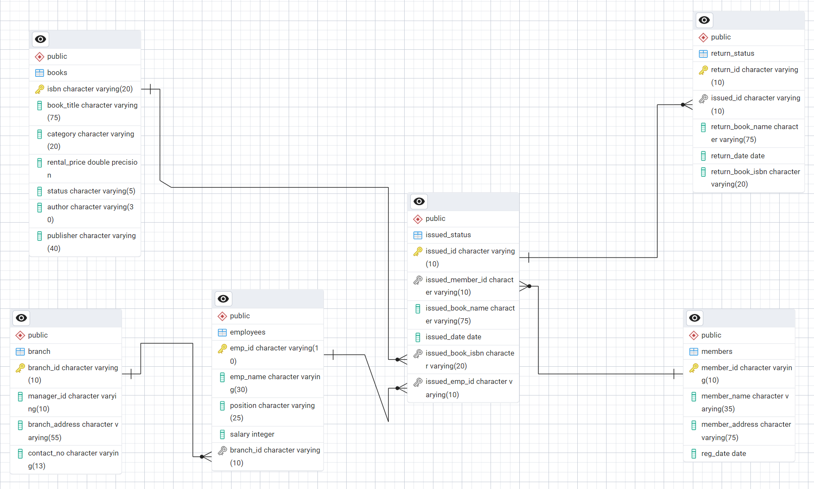
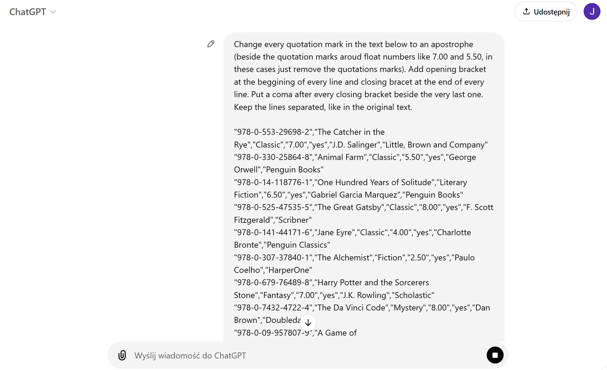

# Library Management System (SQL)

## Project Overview

**Level**: Pre-intermediate  

This project demonstrates the implementation of a Library Management System using SQL. It includes creating database with DDL queries, establishing relationships between tables, inserting first records into tables, performing another CRUD operations and executing more advanced SQL queries like CTE. The goal is to showcase skills in database design, manipulation and querying.


## Objectives

1. **Set up the Library Management System database**: Create the database with tables for books, branches, employees, members, issued status, and return status using DDL commands. Establish relationships between tables (main key and foreign keys).
2. **Insert first records**: Insert records using given CSV file.
3. **Complete tasks by creating queries**: Complete tasks using DQL commands, including CRUD operations, CTAS and another queries for data analysis and findings.
4. **Update a database**: Update a database by inserting new issuances, adding new column in return status table and updating values in this column.
5. **Complete more advanced tasks**: Complete tasks like identifying members with overdue books and counting total fines.

## Project Structure

### 1. Setting up the Library Management System database

- **Creating database**: Created a database named `LIBRARY_project` using pgAdmin user interface.
- **Creating tables**: Created tables for branches, employees, books, members, issued status, and return status. Each table includes relevant columns and relationships.

```sql
-- creating tables

DROP TABLE IF EXISTS branch;
CREATE TABLE branch
	(
	branch_id VARCHAR(10) PRIMARY KEY,
	manager_id VARCHAR(10),
	branch_address VARCHAR(55),
	contact_no VARCHAR(13)
	);


DROP TABLE IF EXISTS employees;
CREATE TABLE employees
	(
	emp_id VARCHAR(10) PRIMARY KEY,
	emp_name VARCHAR(35),
	position VARCHAR(25),
	salary INT,
	branch_id VARCHAR(10) --FK
	);

	
DROP TABLE IF EXISTS books;
CREATE TABLE books
	(
	isbn VARCHAR(20) PRIMARY KEY,
	book_title VARCHAR(75),
	category VARCHAR(20),
	rental_price FLOAT,
	status VARCHAR(5),
	author VARCHAR(35),
	publisher VARCHAR(40)
	);


DROP TABLE IF EXISTS members;
CREATE TABLE members
	(
	member_id VARCHAR(10) PRIMARY KEY,
	member_name VARCHAR(35),
	member_address VARCHAR(75),
	reg_date DATE
	);


DROP TABLE IF EXISTS issued_status;
CREATE TABLE issued_status
	(
	issued_id VARCHAR(10) PRIMARY KEY,
	issued_member_id VARCHAR(10), --FK
	issued_book_name VARCHAR (75),
	issued_date DATE,
	issued_book_isbn VARCHAR(20), --FK
	issued_emp_id VARCHAR(10) --FK
	);


DROP TABLE IF EXISTS return_status;
CREATE TABLE return_status
	(
	return_id VARCHAR(10) PRIMARY KEY,
	issued_id VARCHAR(10),
	return_book_name VARCHAR(75),
	return_date DATE,
	return_book_isbn VARCHAR(20)
	);


-- adding FOREIGN KEY

ALTER TABLE issued_status
ADD CONSTRAINT fk_members
FOREIGN KEY (issued_member_id)
REFERENCES members(member_id);

ALTER TABLE issued_status
ADD CONSTRAINT fk_books
FOREIGN KEY (issued_book_isbn)
REFERENCES books(isbn);

ALTER TABLE issued_status
ADD CONSTRAINT fk_employees
FOREIGN KEY (issued_emp_id)
REFERENCES employees(emp_id);

ALTER TABLE employees
ADD CONSTRAINT fk_branch
FOREIGN KEY (branch_id)
REFERENCES branch(branch_id);

ALTER TABLE return_status
ADD CONSTRAINT fk_issued_status
FOREIGN KEY (issued_id)
REFERENCES issued_status(issued_id);


-- column changes

ALTER TABLE employees
ALTER COLUMN salary TYPE DECIMAL(10,2);

ALTER TABLE books
ALTER COLUMN rental_price TYPE DECIMAL(5,2);

ALTER TABLE books
RENAME COLUMN status TO avail_status;

```

- **Creating EDB**: Created legible Entitiy Relationship Diagram to show dependencies between tables.



### 2. Inserting first records

- **Creating SQL code from CSV file**: Using ChatGPT to change CSV file content into SQL code



- **Inserting first records**: Inserted first records with adjusted code

```sql
-- Inserting values into books table 

INSERT INTO books(isbn, book_title, category, rental_price, status, author, publisher) 
VALUES
('978-0-553-29698-2', 'The Catcher in the Rye', 'Classic', 7.00, 'yes', 'J.D. Salinger', 'Little, Brown and Company'),
('978-0-330-25864-8', 'Animal Farm', 'Classic', 5.50, 'yes', 'George Orwell', 'Penguin Books'),
('978-0-14-118776-1', 'One Hundred Years of Solitude', 'Literary Fiction', 6.50, 'yes', 'Gabriel Garcia Marquez', 'Penguin Books'),
('978-0-525-47535-5', 'The Great Gatsby', 'Classic', 8.00, 'yes', 'F. Scott Fitzgerald', 'Scribner'),
('978-0-141-44171-6', 'Jane Eyre', 'Classic', 4.00, 'yes', 'Charlotte Bronte', 'Penguin Classics'),
('978-0-307-37840-1', 'The Alchemist', 'Fiction', 2.50, 'yes', 'Paulo Coelho', 'HarperOne'),
('978-0-679-76489-8', 'Harry Potter and the Sorcerers Stone', 'Fantasy', 7.00, 'yes', 'J.K. Rowling', 'Scholastic'),
('978-0-7432-4722-4', 'The Da Vinci Code', 'Mystery', 8.00, 'yes', 'Dan Brown', 'Doubleday'),
('978-0-09-957807-9', 'A Game of Thrones', 'Fantasy', 7.50, 'yes', 'George R.R. Martin', 'Bantam'),
('978-0-393-05081-8', 'A Peoples History of the United States', 'History', 9.00, 'yes', 'Howard Zinn', 'Harper Perennial'),
('978-0-19-280551-1', 'The Guns of August', 'History', 7.00, 'yes', 'Barbara W. Tuchman', 'Oxford University Press'),
('978-0-307-58837-1', 'Sapiens: A Brief History of Humankind', 'History', 8.00, 'no', 'Yuval Noah Harari', 'Harper Perennial'),
('978-0-375-41398-8', 'The Diary of a Young Girl', 'History', 6.50, 'no', 'Anne Frank', 'Bantam'),
('978-0-14-044930-3', 'The Histories', 'History', 5.50, 'yes', 'Herodotus', 'Penguin Classics'),
('978-0-393-91257-8', 'Guns, Germs, and Steel: The Fates of Human Societies', 'History', 7.00, 'yes', 'Jared Diamond', 'W. W. Norton & Company'),
('978-0-7432-7357-1', '1491: New Revelations of the Americas Before Columbus', 'History', 6.50, 'no', 'Charles C. Mann', 'Vintage Books'),
('978-0-679-64115-3', '1984', 'Dystopian', 6.50, 'yes', 'George Orwell', 'Penguin Books'),
('978-0-14-143951-8', 'Pride and Prejudice', 'Classic', 5.00, 'yes', 'Jane Austen', 'Penguin Classics'),
('978-0-452-28240-7', 'Brave New World', 'Dystopian', 6.50, 'yes', 'Aldous Huxley', 'Harper Perennial'),
('978-0-670-81302-4', 'The Road', 'Dystopian', 7.00, 'yes', 'Cormac McCarthy', 'Knopf'),
('978-0-385-33312-0', 'The Shining', 'Horror', 6.00, 'yes', 'Stephen King', 'Doubleday'),
('978-0-451-52993-5', 'Fahrenheit 451', 'Dystopian', 5.50, 'yes', 'Ray Bradbury', 'Ballantine Books'),
('978-0-345-39180-3', 'Dune', 'Science Fiction', 8.50, 'yes', 'Frank Herbert', 'Ace'),
('978-0-375-50167-0', 'The Road', 'Dystopian', 7.00, 'yes', 'Cormac McCarthy', 'Vintage'),
('978-0-06-025492-6', 'Where the Wild Things Are', 'Children', 3.50, 'yes', 'Maurice Sendak', 'HarperCollins'),
('978-0-06-112241-5', 'The Kite Runner', 'Fiction', 5.50, 'yes', 'Khaled Hosseini', 'Riverhead Books'),
('978-0-06-440055-8', 'Charlotte''s Web', 'Children', 4.00, 'yes', 'E.B. White', 'Harper & Row'),
('978-0-679-77644-3', 'Beloved', 'Fiction', 6.50, 'yes', 'Toni Morrison', 'Knopf'),
('978-0-14-027526-3', 'A Tale of Two Cities', 'Classic', 4.50, 'yes', 'Charles Dickens', 'Penguin Books'),
('978-0-7434-7679-3', 'The Stand', 'Horror', 7.00, 'yes', 'Stephen King', 'Doubleday'),
('978-0-451-52994-2', 'Moby Dick', 'Classic', 6.50, 'yes', 'Herman Melville', 'Penguin Books'),
('978-0-06-112008-4', 'To Kill a Mockingbird', 'Classic', 5.00, 'yes', 'Harper Lee', 'J.B. Lippincott & Co.'),
('978-0-553-57340-1', '1984', 'Dystopian', 6.50, 'yes', 'George Orwell', 'Penguin Books'),
('978-0-7432-4722-5', 'Angels & Demons', 'Mystery', 7.50, 'yes', 'Dan Brown', 'Doubleday'),
('978-0-7432-7356-4', 'The Hobbit', 'Fantasy', 7.00, 'yes', 'J.R.R. Tolkien', 'Houghton Mifflin Harcourt');
SELECT * FROM books;


-- Inserting values into branch table

INSERT INTO branch(branch_id, manager_id, branch_address, contact_no) 
VALUES
('B001', 'E109', '123 Main St', '+919099988676'),
('B002', 'E109', '456 Elm St', '+919099988677'),
('B003', 'E109', '789 Oak St', '+919099988678'),
('B004', 'E110', '567 Pine St', '+919099988679'),
('B005', 'E110', '890 Maple St', '+919099988680');
SELECT * FROM branch;


-- Inserting values into employees table

INSERT INTO employees(emp_id, emp_name, position, salary, branch_id) 
VALUES
('E101', 'John Doe', 'Clerk', 60000.00, 'B001'),
('E102', 'Jane Smith', 'Clerk', 45000.00, 'B002'),
('E103', 'Mike Johnson', 'Librarian', 55000.00, 'B001'),
('E104', 'Emily Davis', 'Assistant', 40000.00, 'B001'),
('E105', 'Sarah Brown', 'Assistant', 42000.00, 'B001'),
('E106', 'Michelle Ramirez', 'Assistant', 43000.00, 'B001'),
('E107', 'Michael Thompson', 'Clerk', 62000.00, 'B005'),
('E108', 'Jessica Taylor', 'Clerk', 46000.00, 'B004'),
('E109', 'Daniel Anderson', 'Manager', 57000.00, 'B003'),
('E110', 'Laura Martinez', 'Manager', 41000.00, 'B005'),
('E111', 'Christopher Lee', 'Assistant', 65000.00, 'B005');
SELECT * FROM employees;


-- Inserting values into members table

INSERT INTO members(member_id, member_name, member_address, reg_date) 
VALUES
('C101', 'Alice Johnson', '123 Main St', '2021-05-15'),
('C102', 'Bob Smith', '456 Elm St', '2021-06-20'),
('C103', 'Carol Davis', '789 Oak St', '2021-07-10'),
('C104', 'Dave Wilson', '567 Pine St', '2021-08-05'),
('C105', 'Eve Brown', '890 Maple St', '2021-09-25'),
('C106', 'Frank Thomas', '234 Cedar St', '2021-10-15'),
('C107', 'Grace Taylor', '345 Walnut St', '2021-11-20'),
('C108', 'Henry Anderson', '456 Birch St', '2021-12-10'),
('C109', 'Ivy Martinez', '567 Oak St', '2022-01-05'),
('C110', 'Jack Wilson', '678 Pine St', '2022-02-25'),
('C118', 'Sam', '133 Pine St', '2024-06-01'),    
('C119', 'John', '143 Main St', '2024-05-01');
SELECT * FROM members;


-- Inserting values into issued table

INSERT INTO issued_status(issued_id, issued_member_id, issued_book_name, issued_date, issued_book_isbn, issued_emp_id) 
VALUES
('IS106', 'C106', 'Animal Farm', '2024-03-10', '978-0-330-25864-8', 'E104'),
('IS107', 'C107', 'One Hundred Years of Solitude', '2024-03-11', '978-0-14-118776-1', 'E104'),
('IS108', 'C108', 'The Great Gatsby', '2024-03-12', '978-0-525-47535-5', 'E104'),
('IS109', 'C109', 'Jane Eyre', '2024-03-13', '978-0-141-44171-6', 'E105'),
('IS110', 'C110', 'The Alchemist', '2024-03-14', '978-0-307-37840-1', 'E105'),
('IS111', 'C109', 'Harry Potter and the Sorcerers Stone', '2024-03-15', '978-0-679-76489-8', 'E105'),
('IS112', 'C109', 'A Game of Thrones', '2024-03-16', '978-0-09-957807-9', 'E106'),
('IS113', 'C109', 'A Peoples History of the United States', '2024-03-17', '978-0-393-05081-8', 'E106'),
('IS114', 'C109', 'The Guns of August', '2024-03-18', '978-0-19-280551-1', 'E106'),
('IS115', 'C109', 'The Histories', '2024-03-19', '978-0-14-044930-3', 'E107'),
('IS116', 'C110', 'Guns, Germs, and Steel: The Fates of Human Societies', '2024-03-20', '978-0-393-91257-8', 'E107'),
('IS117', 'C110', '1984', '2024-03-21', '978-0-679-64115-3', 'E107'),
('IS118', 'C101', 'Pride and Prejudice', '2024-03-22', '978-0-14-143951-8', 'E108'),
('IS119', 'C110', 'Brave New World', '2024-03-23', '978-0-452-28240-7', 'E108'),
('IS120', 'C110', 'The Road', '2024-03-24', '978-0-670-81302-4', 'E108'),
('IS121', 'C102', 'The Shining', '2024-03-25', '978-0-385-33312-0', 'E109'),
('IS122', 'C102', 'Fahrenheit 451', '2024-03-26', '978-0-451-52993-5', 'E109'),
('IS123', 'C103', 'Dune', '2024-03-27', '978-0-345-39180-3', 'E109'),
('IS124', 'C104', 'Where the Wild Things Are', '2024-03-28', '978-0-06-025492-6', 'E110'),
('IS125', 'C105', 'The Kite Runner', '2024-03-29', '978-0-06-112241-5', 'E110'),
('IS126', 'C105', 'Charlotte''s Web', '2024-03-30', '978-0-06-440055-8', 'E110'),
('IS127', 'C105', 'Beloved', '2024-03-31', '978-0-679-77644-3', 'E110'),
('IS128', 'C105', 'A Tale of Two Cities', '2024-04-01', '978-0-14-027526-3', 'E110'),
('IS129', 'C105', 'The Stand', '2024-04-02', '978-0-7434-7679-3', 'E110'),
('IS130', 'C106', 'Moby Dick', '2024-04-03', '978-0-451-52994-2', 'E101'),
('IS131', 'C106', 'To Kill a Mockingbird', '2024-04-04', '978-0-06-112008-4', 'E101'),
('IS132', 'C106', 'The Hobbit', '2024-04-05', '978-0-7432-7356-4', 'E106'),
('IS133', 'C107', 'Angels & Demons', '2024-04-06', '978-0-7432-4722-5', 'E106'),
('IS134', 'C107', 'The Diary of a Young Girl', '2024-04-07', '978-0-375-41398-8', 'E106'),
('IS135', 'C107', 'Sapiens: A Brief History of Humankind', '2024-04-08', '978-0-307-58837-1', 'E108'),
('IS136', 'C107', '1491: New Revelations of the Americas Before Columbus', '2024-04-09', '978-0-7432-7357-1', 'E102'),
('IS137', 'C107', 'The Catcher in the Rye', '2024-04-10', '978-0-553-29698-2', 'E103'),
('IS138', 'C108', 'The Great Gatsby', '2024-04-11', '978-0-525-47535-5', 'E104'),
('IS139', 'C109', 'Harry Potter and the Sorcerers Stone', '2024-04-12', '978-0-679-76489-8', 'E105'),
('IS140', 'C110', 'Animal Farm', '2024-04-13', '978-0-330-25864-8', 'E102');
SELECT * FROM issued_status;


-- Inserting values into return table

INSERT INTO return_status(return_id, issued_id, return_date) 
VALUES
('RS104', 'IS106', '2024-05-01'),
('RS105', 'IS107', '2024-05-03'),
('RS106', 'IS108', '2024-05-05'),
('RS107', 'IS109', '2024-05-07'),
('RS108', 'IS110', '2024-05-09'),
('RS109', 'IS111', '2024-05-11'),
('RS110', 'IS112', '2024-05-13'),
('RS111', 'IS113', '2024-05-15'),
('RS112', 'IS114', '2024-05-17'),
('RS113', 'IS115', '2024-05-19'),
('RS114', 'IS116', '2024-05-21'),
('RS115', 'IS117', '2024-05-23'),
('RS116', 'IS118', '2024-05-25'),
('RS117', 'IS119', '2024-05-27'),
('RS118', 'IS120', '2024-05-29');
SELECT * FROM return_status;
```

### 3. Completing tasks by creating queries

**Task 1. Create a New Book Record:**

"'978-1-60129-456-2', 'To Kill a Mockingbird', 'Classic', 6.00, 'yes', 'Harper Lee', 'J.B. Lippincott & Co.'"

```sql
INSERT INTO books 
VALUES ('978-1-60129-456-2', 'To Kill a Mockingbird', 'Classic', 6.00, 'yes', 'Harper Lee', 'J.B. Lippincott & Co.');
```

**Task 2. Update an Existing Member's Address (knowing his member id):**

Member id: C103
New address: 125 Oak St

```sql
UPDATE members
SET member_address = '125 Oak St'
WHERE member_id = 'C103';
```

**Task 3. Delete a Record from the Issued Status Table (knowing the book name, issued date and the id of employee who issued the book):**

Book name: The Shining
Issued date: 2024-03-25
Employee id: E109

```sql
DELETE FROM issued_status
WHERE issued_book_name = 'The Shining' AND issued_date = '2024-03-25' AND issued_emp_id = 'E109';
```

**Task 4. Retrieve All Books Issued by a Specific Employee (knowing his name):**

Employee name: John Doe

```sql
SELECT issued_book_name 
FROM issued_status
WHERE issued_emp_id = 
	(
	SELECT emp_id 
	FROM employees
	WHERE emp_name = 'John Doe'
	)
;
```

**Task 5: List members who have been issued more than one book**

```sql
-- Taking a peek at the list of members with the quantity of books
SELECT 
	issued_member_id,
	COUNT(issued_id) as total_book_issued
FROM issued_status
GROUP BY issued_member_id;

-- Selecting members who have been issued more than one book
SELECT issued_member_id
FROM issued_status
GROUP BY issued_member_id
HAVING COUNT(*) > 1;
```

**Task 6. Create summary table with each book and it’s issuance quantity**

```sql
-- Displaying the table which I'm gonna create
SELECT
	b.isbn,
	b.book_title,
	COUNT(issued_id) as total_issuance_quantity
FROM books as b
JOIN issued_status as ist
ON ist.issued_book_isbn = b.isbn
GROUP BY b.isbn;

-- Creating the table
CREATE TABLE book_issuance_qty
AS
SELECT
	b.isbn,
	b.book_title,
	COUNT(issued_id) as total_issuance_quantity
FROM books as b
JOIN issued_status as ist
ON ist.issued_book_isbn = b.isbn
GROUP BY b.isbn;
```

**Task 7. Retrieve All Books in a Specific Category:**

Category: Classic

```sql
SELECT *
FROM books
WHERE category = 'Classic';
```

**Task 8. Find Total Rental Income by Category**

```sql
SELECT 
    b.category,
	COUNT(issued_id) as total_issuance_quantity,
    SUM(b.rental_price) as total_rental_income
FROM books as b
JOIN issued_status as ist
ON ist.issued_book_isbn = b.isbn
GROUP BY b.category;
```

**Task 9. List members who registered in the last 180 days**

```sql
SELECT * 
FROM members
WHERE reg_date >= CURRENT_DATE - INTERVAL '179 days';
```

**Task 10. List employees with their branch manager's name and their branch details**

```sql
SELECT 
    e1.emp_id as employee_id,
    e1.emp_name as employee_name,
    e1.position as employee_position,
    br.branch_id,
	br.manager_id,
	br.branch_address,
	br.contact_no as manager_contact_no,
    e2.emp_name as manager_name
FROM employees as e1
JOIN branch as br
ON e1.branch_id = br.branch_id    
JOIN employees as e2
ON e2.emp_id = br.manager_id;
```

**Task 11.  Create a table of books with rental prices that fall within the specified range:**

Range: from 7 (inclusive) to 9 (inclusive)

```sql
CREATE TABLE books_with_7_to_9_price 
AS
SELECT *
FROM books
WHERE rental_price BETWEEN 7.00 AND 9.00;
```

**Task 12. Retrieve the list of books not yet returned**

```sql
SELECT
	ist.*,
	rst.return_id
FROM issued_status as ist
LEFT JOIN return_status as rst
ON rst.issued_id = ist.issued_id
WHERE rst.return_id IS NULL
ORDER BY issued_date ASC; -- ordering by the date of issuance to see which books where borrowed the farthest back in time
```

### 4. Updateing a database

```sql
-- Inserting new issuances into the table

INSERT INTO 
issued_status(issued_id, issued_member_id, issued_book_name, issued_date, issued_book_isbn, issued_emp_id)
VALUES
('IS151', 'C105', 'The Road', CURRENT_DATE - INTERVAL '32 days',  '978-0-375-50167-0', 'E101'),
('IS152', 'C118', 'Jane Eyre', CURRENT_DATE - INTERVAL '24 days',  '978-0-141-44171-6', 'E108'),
('IS153', 'C119', 'To Kill a Mockinbird', CURRENT_DATE - INTERVAL '13 days',  '978-1-60129-456-2', 'E109'),
('IS154', 'C106', 'Pride and Prejudice', CURRENT_DATE - INTERVAL '7 days',  '978-0-14-143951-8', 'E107');

-- Adding new column in return_status

ALTER TABLE return_status
ADD COLUMN book_quality VARCHAR(15) DEFAULT('Good');

-- Updating quality status in several books

UPDATE return_status
SET book_quality = 'Damaged'
WHERE issued_id 
    IN ('IS112', 'IS117', 'IS118');
```

### 5. Completing more advanced tasks

**Task 13. Identify Members with Overdue Books:**

Write a query to identify members who have overdue books (30-day return period). 
Display the member's_id, member's name, book title, issue date, and days overdue.

```sql
SELECT
	m.member_id,
	m.member_name,
	ist.issued_book_name,
	ist.issued_date,
	CURRENT_DATE - (ist.issued_date + INTERVAL '30 days') as days_overdue
FROM 
	members as m
JOIN 
	issued_status as ist
	ON m.member_id = ist.issued_member_id
LEFT JOIN 
	return_status as rst
	ON rst.issued_id = ist.issued_id
WHERE
	rst.return_date IS NULL
	AND
	(CURRENT_DATE - ist.issued_date) > 30
ORDER BY ist.issued_date;
```

**Task 14. Update availability status in books table:**

Write a query to update or correct the availability status of books in the books table 
to "yes" when they are available (returned or never issued)
and "no" when they are not available (issued but not returned).
(This library has only one copy of the book per every isbn code.)

```sql
UPDATE books
SET avail_status = CASE
    WHEN isbn IN
    	(
		SELECT issued_book_isbn
		FROM issued_status as ist
		LEFT JOIN return_status as rst
		ON rst.issued_id = ist.issued_id
		WHERE rst.return_id IS NULL
		)
	THEN 'no'
    ELSE 'yes'   -- it takes into account cases where the book has never been issued
	END
;
```

**Task 15. Create branch performance report:**

Create a table that shows a performance report for each branch, 
showing the number of books issued, the number of books returned 
and the total revenue generated from book rentals.

```sql
CREATE TABLE branch_reports
AS
SELECT 
    br.branch_id,
    COUNT(ist.issued_id) as total_books_issued,
    COUNT(rst.return_date) as total_books_returned,
    SUM(b.rental_price) as total_revenue
FROM 
	branch as br
JOIN 
    employees as e 
	ON br.branch_id = e.branch_id
JOIN 
    issued_status as ist 
	ON e.emp_id = ist.issued_emp_id
JOIN 
    books as b 
	ON ist.issued_book_isbn = b.isbn
LEFT JOIN 
    return_status as rst 
	ON ist.issued_id = rst.issued_id
GROUP BY 
    br.branch_id;
```

**Task 16. Create a table of active members:**

Active member means member who have issued at least one book in the last 2 months.

```sql
CREATE TABLE active_members
AS
SELECT *
FROM 
	members
WHERE 
	member_id IN 
		(
		SELECT 
			issued_member_id
		FROM
			issued_status
		WHERE 
			issued_date >= CURRENT_DATE - INTERVAL '2 months'
		)
GROUP BY
	member_id;
```

**Task 17. Find employees with the most book issues processed:**

Write a query to find the top 3 employees who have processed the most book issues. 
Display the employee name, number of books processed, and their branch.

```sql
SELECT 
	e.emp_id,
	e.emp_name,
	e.branch_id,
	COUNT(ist.issued_id) as total_books_issued
FROM
	issued_status as ist
JOIN
	employees as e
	ON ist.issued_emp_id = e.emp_id
GROUP BY
	e.emp_id
ORDER BY
	total_books_issued DESC
LIMIT 3;
```

**Task 18. Create tables to identify overdue books and calculate fines:**

Create a new table that lists each member who has issued book or books but not returned within 30 days. 
The table should include: member’s id, their name, every overdue book’s id and title and calculated fine 
per every book (each day a book is kept past the due date incurs a charge of $0.50). 
Then create another table which sums up the fine for each member.

```sql
-- first table
CREATE TABLE overdue_books_and_fines
AS
WITH overdue_books as 
	(
    SELECT
        m.member_id,
        m.member_name,
        ist.issued_id as overdue_book_id,
        ist.issued_book_name as overdue_book_name,
        CURRENT_DATE - (ist.issued_date + INTERVAL '30 days') as days_overdue
    FROM 
        members AS m
    JOIN 
        issued_status AS ist
        ON m.member_id = ist.issued_member_id
    LEFT JOIN 
        return_status AS rst
        ON rst.issued_id = ist.issued_id
    WHERE
        rst.return_date IS NULL
        AND
        (CURRENT_DATE - ist.issued_date) > 30
	)
SELECT
    member_id,
    member_name,
    overdue_book_id,
    overdue_book_name,
    days_overdue,
    EXTRACT(DAY FROM(days_overdue)) * 0.50 as fine_amount
FROM 
    overdue_books
ORDER BY 
    member_id, days_overdue DESC;

-- second table
CREATE TABLE total_fine_per_member
AS
SELECT
	member_id,
	member_name,
	SUM(fine_amount) as total_fine_to_pay
FROM 
	overdue_books_and_fines
GROUP BY
	member_id,
	member_name
ORDER BY member_id;
```


## Reports

- **Database Schema**: Detailed table structures and relationships.
- **Data Analysis**: Insights into book categories, employee salaries, member registration trends, and issued books.
- **Summary Reports**: Aggregated data on high-demand books and employee performance.

## Conclusion

This project demonstrates the application of SQL skills in creating and managing a library management system. It includes database setup, data manipulation, and advanced querying, providing a solid foundation for data management and analysis.

## How to Use

1. **Clone the Repository**: Clone this repository to your local machine.
   ```sh
   git clone https://github.com/najirh/Library-System-Management---P2.git
   ```

2. **Set Up the Database**: Execute the SQL scripts in the `database_setup.sql` file to create and populate the database.
3. **Run the Queries**: Use the SQL queries in the `analysis_queries.sql` file to perform the analysis.
4. **Explore and Modify**: Customize the queries as needed to explore different aspects of the data or answer additional questions.

## Author - Zero Analyst

This project showcases SQL skills essential for database management and analysis. For more content on SQL and data analysis, connect with me through the following channels:

- **YouTube**: [Subscribe to my channel for tutorials and insights](https://www.youtube.com/@zero_analyst)
- **Instagram**: [Follow me for daily tips and updates](https://www.instagram.com/zero_analyst/)
- **LinkedIn**: [Connect with me professionally](https://www.linkedin.com/in/najirr)
- **Discord**: [Join our community for learning and collaboration](https://discord.gg/36h5f2Z5PK)

Thank you for your interest in this project!
